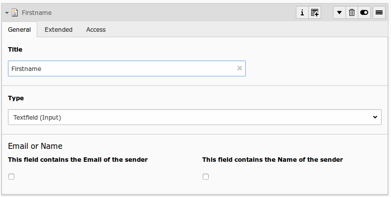
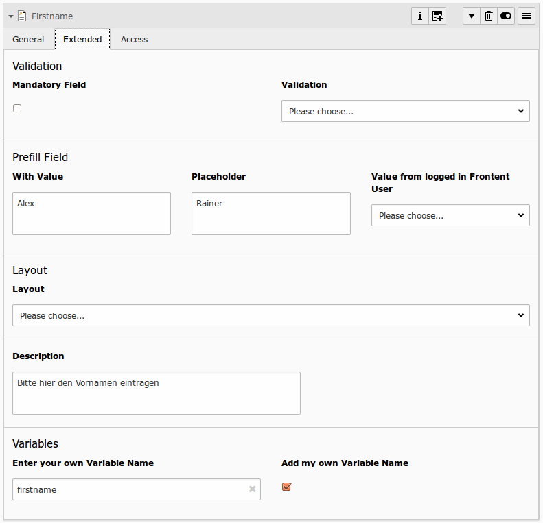

# Textfield (Input)

## What does it do?

- **General:** An input field is the most used field for forms. The user can fill it in just one line.
- **Mandatory:** This field could be marked as mandatory, so the user must fill out this field, otherwise the form can not be submitted.
- **Validation:** This field can also be validated (HTML5, JavaScript and/or PHP) for different inputtypes (email, url, phone, numbers only, letters only, min number, max number, range, length, pattern)
- **Prefill:** An input field can be prefilled from FlexForm, TypoScript, GET/Post-Params or from FE_User table.

## Frontend Output Example

## Backend Configuration Example

## Explanation

| Field | Description | Explanation | Tab |
|------------------------------------|-----------------------------------------------------------------------------------|--------------------------------------------------------------------------------------------------------------------------------------------------------------------------------------------------------------------------|----------|
| Title | Add a label for this field. | The label is shown in the frontend near to this field. | General |
| Type | Choose a fieldtype. | See explanation below for a special fieldtype. Different fields are  related to some fieldtypes – not all fields are shown on every type. | General |
| Email of sender | Check this if this field contains the email of the sender. | This is needed to set the correct sender-email-address. If there is no  field marked as Senderemail within the current form, powermail will use a  default value for the Senderemail. | General |
| Name of sender | Check this if this field contains the name (or a part of the name) of the sender. | This is needed to set the correct sender-name. If there is no field  marked as Sendername within the current form, powermail will use a  default value for the Sendername. | General |
| Mandatory Field | This field must contain input. | Check this if the field must contain input, otherwise submitting the form is not possible. | Extended |
| Validation | Validate the user input with a validator. | Possible Validation Methods are: Email, URL, Phone, Numbers only,  Letters only, Min Number, Max Number, Range, Length, Pattern (RegEx) | Extended |
| Prefill with value | Prefill field value with a static content. | Other possibilities to prefill a field: TypoScript, GET or POST params | Extended |
| Placeholder | Add a placeholder for this input field. | A placeholder text is an example, that should help the user to fill out  an input field. This text is shown in bright grey within the input  field. If you have a name field, you could use the placeholder “John  Doe". | Extended |
| Value from logged in Frontend User | Check if field should be filled from the FE_Users table of a logged in fe_user. | This value overwrites a static value, if set. | Extended |
| Layout | Choose a layout. | This adds a CSS-Class to the frontend output. Administrator can add, remove or rename some of the entries. | Extended |
| Description | Add a description for this field. | Per default a description will be rendered as title-attribute in the labels in frontend. | Extended |
| Variables – Individual Fieldname | This is a marker of this field. | Use a field variable with {marker} in any RTE or HTML-Template. The marker name is equal in any language. | Extended |
| Add own Variable | Check this, if you want to set your own marker (see row before). | After checking this button, TYPO3 ask you to reload. After a reload, you see a new field for setting an own marker. | Extended |
| Language | Choose a language. | Choose in which frontend language this record should be rendered. | Access |
| Hide | Disable the form | Enable or disable this record. | Access |
| Start | Startdate for this record. | Same function as known from default content elements or pages in TYPO3. | Access |
| Stop | Stopdate for this record. | Same function as known from default content elements or pages in TYPO3. | Access |

## Validation

Administrator can enable or disable the validation in general with TypoScript (see TypoScript part in manual).

- HTML5 Validation
- Clientside Validation with own JavaScript framework
- Serverside Validation with PHP

| Validation Type | Description | Examples | Note |
|------------------------------------|-----------------------------------------------------------------------------------|--------------------------------------------------------------------------------------------------------------------------------------------------------------------------------------------------------------------------|-------------------|
| Mandatory | This simple checkbox forces the user to add a value for the current field. | any text | The HTML5 attribute required="required" is used if HTML5-Validation is turned on. |
| Email | If email validation is turned on, the visitor has to fill in the field with a correct email address or let it empty. | firstname.lastname@domain.org name@subdomain.domain.org | No HTML5 type - type="text" is used |
| URL | If url validation is turned on, the visitor has to fill in the field with a correct url. | http://www.test.org www.test.org | No HTML5 type - type="text" is used |
| Phone | If turned on, visitor must leave a string with a phone syntax. | 01234567890 0123 4567890 0123 456 789 (0123) 45678 - 90 0012 345 678 9012 0012 (0)345 / 67890 - 12 +123456789012 +12 345 678 9012 +12 3456 7890123 +49 (0) 123 3456789 +49 (0)123 / 34567 - 89 | input with type="tel" is used if HTML5-Validation is turned on. |
| Numbers only | If turned on, visitor can only fill in numbers (no space or other characters allowed) | 123 68465135135135185 | input with type="number" is used if HTML5-Validation is turned on.  Leading zeros are removed, so this validation type cannot be used to validate German ZIP codes. Use the `pattern` type instead. |
| Letters only | If turned on, visitor can only fill in letters (no space, no numbers, no special characters, no umlauts and no accent allowed) | abc qwertz | No HTML5 type - type="text" is used |
| Min Number | Min Number is used to check if a number (integer) is greater then a configured number. So the visitor has to insert an integer. If turned on, an additional field "Validation Configuration" comes up. Validation depends on the value in this field. The editor should enter an integer in this field - e.g. 3 | 3 => 4 or 5 or 1000 or more 123 => 124 or 1000 or 99999 or more | No HTML5 type - type="text" is used |
| Max Number | Max Number is used to check if a number (integer) is less then a configured number. So the visitor has to insert an integer.  If turned on, an additional field "Validation Configuration" comes up. Validation depends on the value in this field. The editor should enter an integer in this field - e.g. 3 | 3 => 2 or 1 or 0 123 => 122 or 100 or 10 or less | No HTML5 type - type="text" is used |
| Range | Range allows the visitor to add an integer between a start and a stop value.  If turned on, an additional field "Validation Configuration" comes up. Validation depends on the value in this field. The editor should enter a start and a stop value - e.g. 5,15 for start with 5 and stop with 15 | 5,15 => 5 or 10 or 15 0,100 => 1 or 25 or 100 | input with type="range" is used if HTML5-Validation is turned on. |
| Length | Length allows the visitor to add characters and numbers. But the length is validated.  If turned on, an additional field "Validation Configuration" comes up. Validation depends on the value in this field. The editor should enter a start and a stop length - e.g. 5,15 for startlength on 5 and stoplength on 15 | 5,15 => ab or abc23efg or abcdefghijklmno 0,3 => 1 or ab or abc | No HTML5 type - type="text" is used |
| Pattern | The visitors input will be validated against a regulare expression.  If turned on, an additional field "Validation Configuration" comes up. Validation depends on the value in this field. The editor can add a regulare expression in this field. See http://html5pattern.com/ or http://bueltge.de/php-regular-expression-schnipsel/917/ for a lot of examples and an introduction to pattern. | `~https?://.+~` => An url with https beginning - https://www.test.org  `^[A-Za-z\u00C0-\u017F]+$` => letters with umlauts, accents and other special letters  `^[A-Za-z\s\u00C0-\u017F]+$` => letters with umlauts and space  `^[a-zA-Z][a-zA-Z0-9-_\.]{1,20}$` => letters/digits for a username with dash, underscore, point (1-20 signs)  `[0-9]{5}` => German ZIP Code (5 digits)  `\d+(,\d{2})?` => Price like 2,20 | No HTML5 type - type="text" is used |
